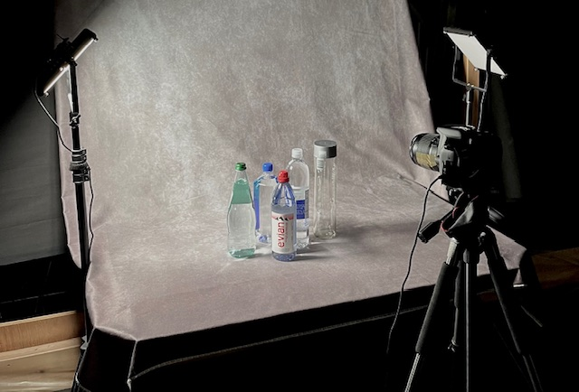
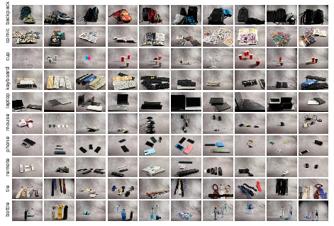
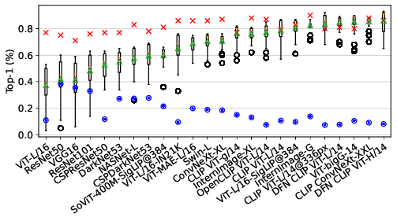
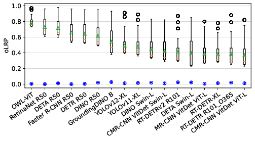
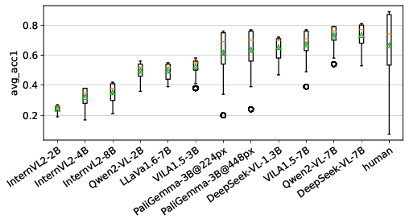
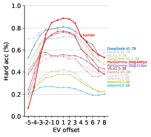

# SNAP Benchmark

https://huggingface.co/api/datasets/ykotseruba/SNAP

This is the official repository for **SNAP** (stands for **S**hutter speed, **I**SO se**N**sitivity, and **AP**erture). SNAP is a new benchmark consisting of images of objects taken under controlled lighting conditions and with densely sampled camera settings.

**Dataset on HuggingFace**: https://huggingface.co/datasets/ykotseruba/SNAP

This repository contains the dataset annotations as well as code to reproduce the results of the paper: I.Kotseruba, J.K.Tsotsos, SNAP: A Benchmark for Testing the Effects of Capture Conditions on Fundamental Vision Tasks, arXiv, 2025.

## Description

SNAP allows testing the effects of capture bias, which includes camera settings and illumination, on performance of vision algorithms. 

SNAP contains 37.5K images uniformly distributed across sensor settings. The images feature everyday objects placed on the table against a plain background.

SNAP includes annotations for the following vision tasks:

- image classification;
- object detection;
- visual question answering (VQA).

SNAP also includes a human baseline for the VQA task on a subset of SNAP images.

## Results

We tested baseline and SOTA models, including 23 image classifiers, 16 object detectors, and 13
vision-language models (VLMs), on image classification, object detection, and visual question
answering (VQA) tasks. **All models were sensitive to camera parameters on all vision tasks.** 

On image classification task, most models do not reach their performance on ImageNet (red crosses). Performance of all models fluctuates depending on exposure (box plots), and most models are sensitive to even small parameter changes (blue dots).

Similarly, on object detection, models are sensitive to exposure, particularly w.r.t. misclassifications.

Lastly, VLMs show similar biases. **Although some VLMs reach parity with human subjects on average, none can match peak human performance**.  

See the paper for more details.

## Data collection

The following setup was used: a Canon Rebel T7 DSLR camera on a tripod, table covered with non-reflective gray fabric, 2 LED dimmable lights, and Yocto-Light-V3 lux meter. The room was blacked-out, LED lights were the only source of light. We placed the light sensor in the middle of the table (where the objects are) to ensure consistent illumination.

### Objects

We selected the following categories of objects since they are present in both ImageNet and COCO dataset used to train models for image classification, object detection, and VQA:

Each image features 2-5 objects of the same class, such that there are some occlusions, shadows, etc. This way image classification is not affected since the objects are in the same category, at the same time, detection/segmentation tasks are made more challenging.

### Illumination

We collected data for 2 illumination conditions: 10 (low-light) and 1000 (daylight) lux. 

### Camera settings

The following camera settings are available in Canon Rebel T7 (Note: we are sampling at 1-stop interval to make data collection less time-consuming):

- Shutter speed (sec): 1/4000 1/2000 1/1000 1/500 1/250 1/125 1/60 1/30 1/15 1/8 1/4 0.5 1 2 4 8 15 30

- ISO: 100 200 400 800 1600 3200 6400

- Aperture: 22 16 11 8 5.6

- Focal length: fixed at 35 mm (middle of the standard range for APS-C sensor)

- Focus: manually set and fixed for each scene

- Flash: disabled

- White balance: manually configured and fixed for each illumination condition

See https://www.slrlounge.com/iso-aperture-shutter-speed-a-cheat-sheet-for-beginners/ for a basic explanation of f-stops, camera parameters, and their effects.

A combination of shutter speed, aperture and ISO settings define exposure, however, the same exposure can be achieved with multiple settings. Here is a webpage that illustrates this well -- https://dima.fi/exposure/. The initial settings are for EV 0, i.e. "optimal exposure" and if you move any of the sliders, it will deviate, e.g. become over (EV +1) or under-exposed (EV -1). To keep EV at 0 you need to compensate by moving one of the other sliders in the opposite direction.

Therefore, we group the images with the same exposure by exposure value (EV) offset. EV offset of 0 is assigned to the bin with "optimal" exposure (auto settings in our case).

### Annotations

The `annotation` folder contains annotations for three tasks:

- **image classification** - object class labels for each image;
- **object detection/instance segmentation** - bounding boxes and masks for each object in each image;
- **visual question answering (VQA)** - 4 question-answer pairs for each image for testing categorization and counting ability of models. 2 questions are open-ended and 2 are multi-choice (with options shuffled for each image):
	- Q1: Objects of what class are in the image? Answer with the name of the class.
	- Q2: How many objects are in the image? Answer with one number.
	- Q3: Objects of what class are in the image? Select one of the following options: cup, comic book, keyboard, laptop, mouse, tie, water bottle, phone, backpack, remote, other
	- Q4: How many objects are in the image? Select one of the following options: A) 1    B) 2    C) 3    D) 4

### Testing models

Models for image classification, object detection, and VLMs are in the `models` directory.

Refer to README.md files in each subdirectory for running instructions.

Each model saves raw results in the `raw_results` folder as excel files.

### Evaluating models

Scripts for evaluating models are in the `eval` directory. See `scripts/eval/README.md` on how to run them.

Evaluation results are written to `eval_results` as excel files.
